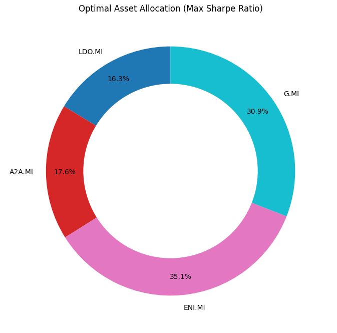
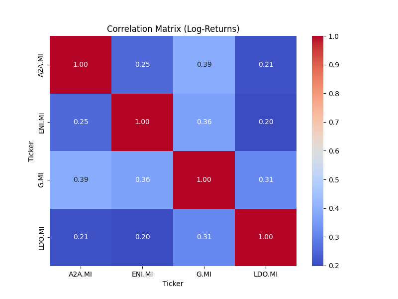
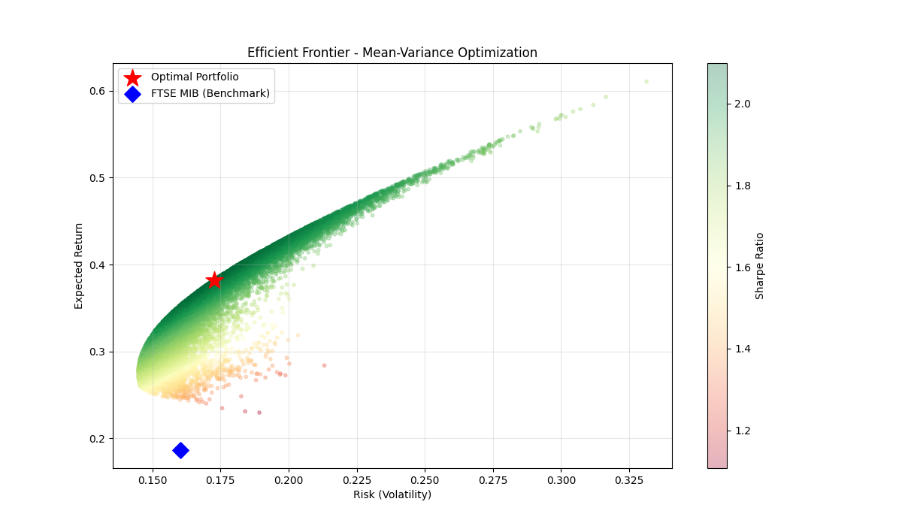
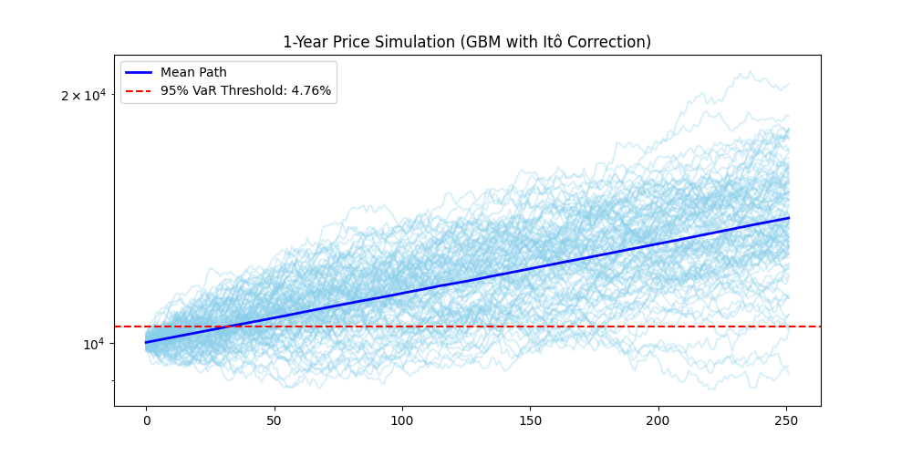
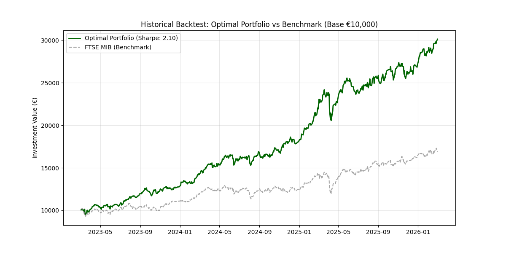
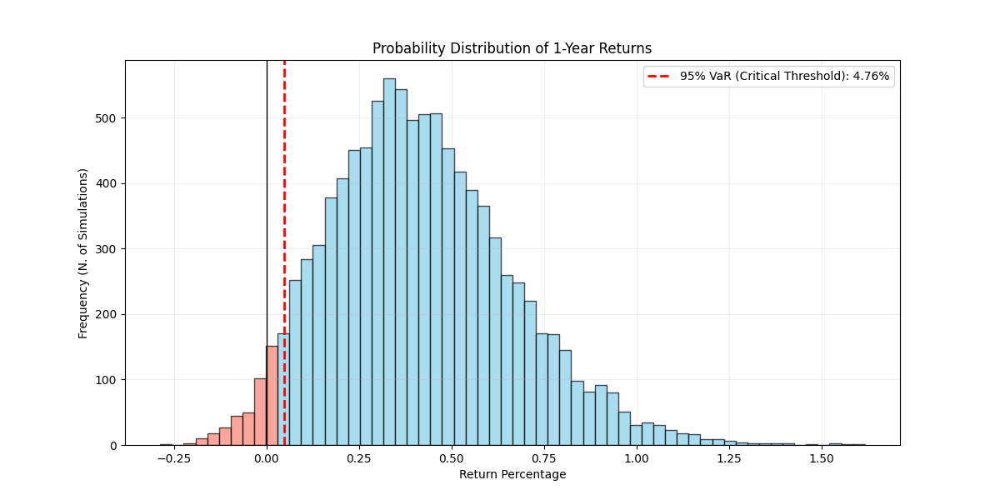

# 🇮🇹 Italian Elite Portfolio Optimizer
**Quantitative Finance project focused on the Italian "National Champions" (LDO.MI, ENI.MI, RACE.MI, G.MI,).**

## 🚀 Project Overview
This tool implements a **Mean-Variance Optimization (Markowitz)** framework to build an optimal equity portfolio using historical data from the FTSE MIB.

### Key Features:
- **Efficient Frontier**: 20,000 Monte Carlo simulations to find the Max Sharpe Ratio.
- **Risk Metrics**: Implementation of **Sortino Ratio**, **Calmar Ratio**, and **Ulcer Index**.
- **Price Projection**: 1-year forward-looking simulation using **Geometric Brownian Motion (GBM)** with Itô's Correction.
- **Backtesting**: Comparative analysis against the **FTSE MIB** benchmark.

## 📊 Visual Analysis & Results

### 1. Optimal Asset Allocation
This donut chart shows the ideal weights for each stock to achieve the Maximum Sharpe Ratio.

### 2. Correlation Matrix
Analysis of how the selected stocks move in relation to each other. Lower correlation improves diversification.

### 3. Efficient Frontier
The "cloud" of 20,000 simulated portfolios. The **red star** is our optimal choice, while the **blue diamond** represents the FTSE MIB benchmark.

### 4. Monte Carlo Price Projection
10,000 possible price paths for the next year (252 trading days) using Geometric Brownian Motion with Itô's Calculus correction.

### 5. Historical Backtest
A comparison of the Optimized Portfolio's performance against the FTSE MIB Index over the last 3 years.

### 6. Probability Distribution & VaR
The distribution of potential returns. The dashed red line marks the **95% Value at Risk (VaR)**, showing the potential loss in a worst-case scenario.

---

## 🛠️ Technical Details
- **Language:** Python
- **Key Metrics:** Sharpe Ratio, Sortino Ratio, Calmar Ratio, Ulcer Index.
- **Correction:** Applied Itô's Lemma to the drift term in price simulations for higher accuracy.

## ⚙️ Setup
1. Clone the repository.
2. Install dependencies: `pip install -r requirements.txt`
3. Run the script: `python your_script_name.py`

